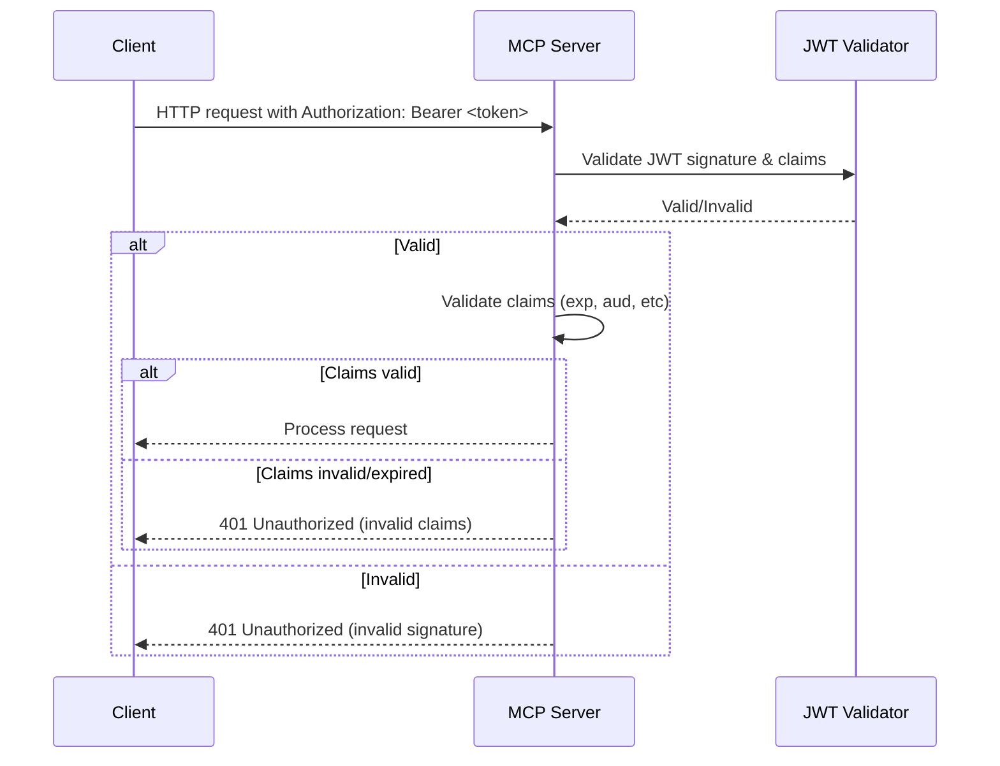
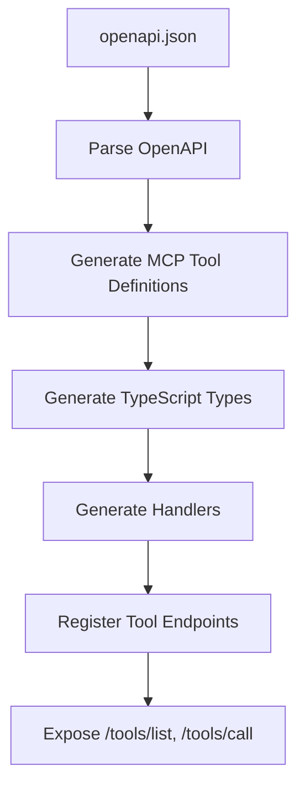
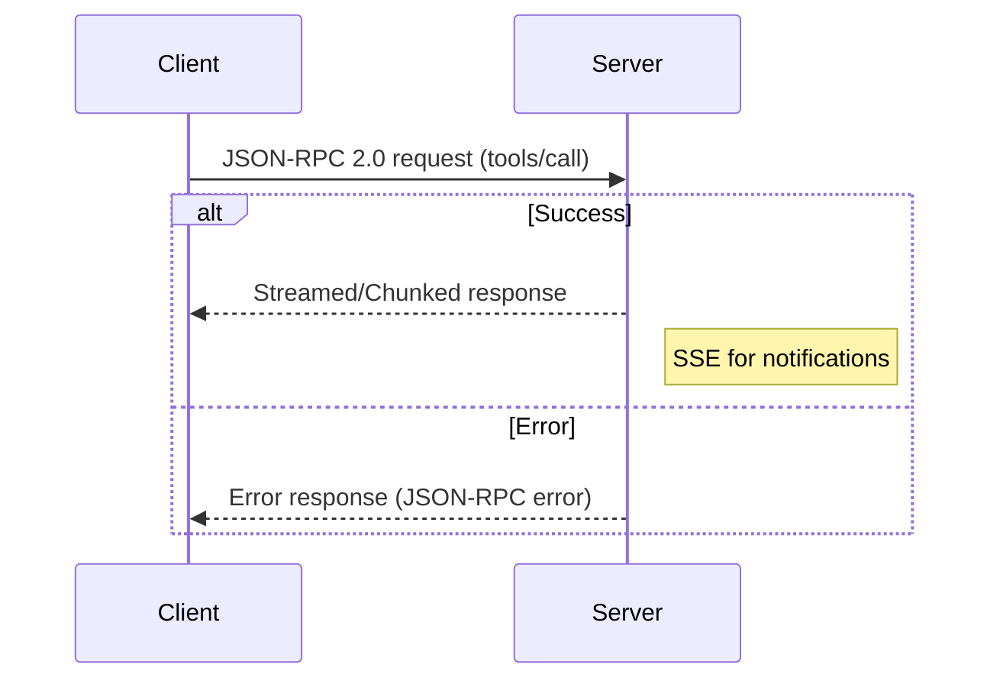
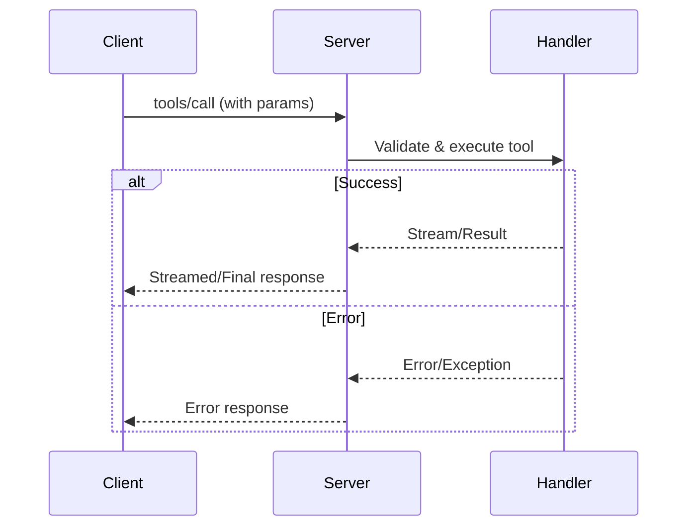
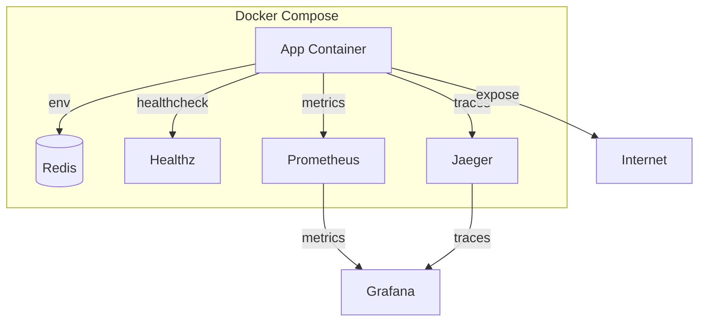
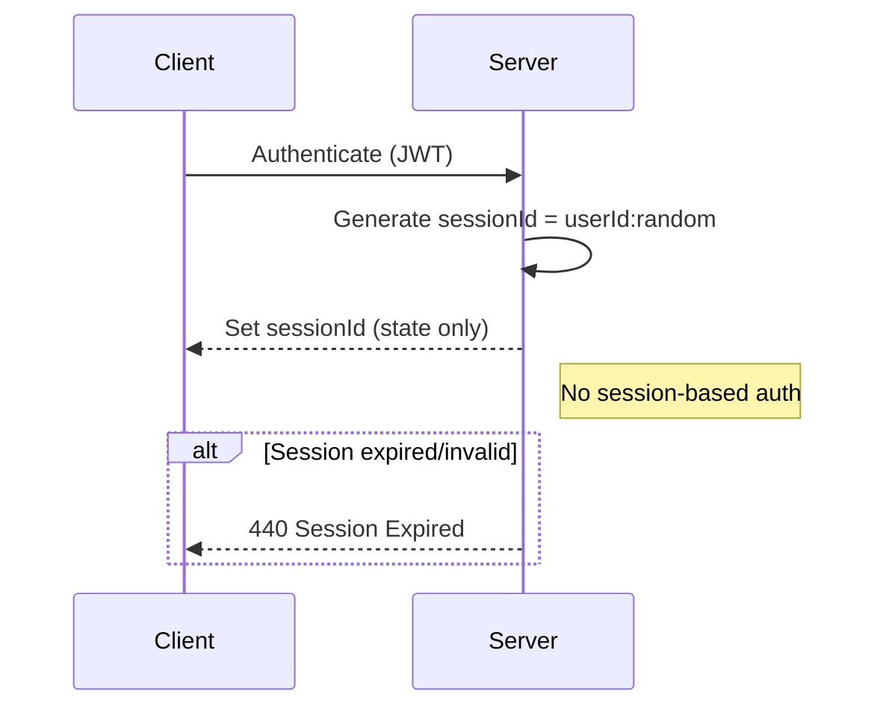
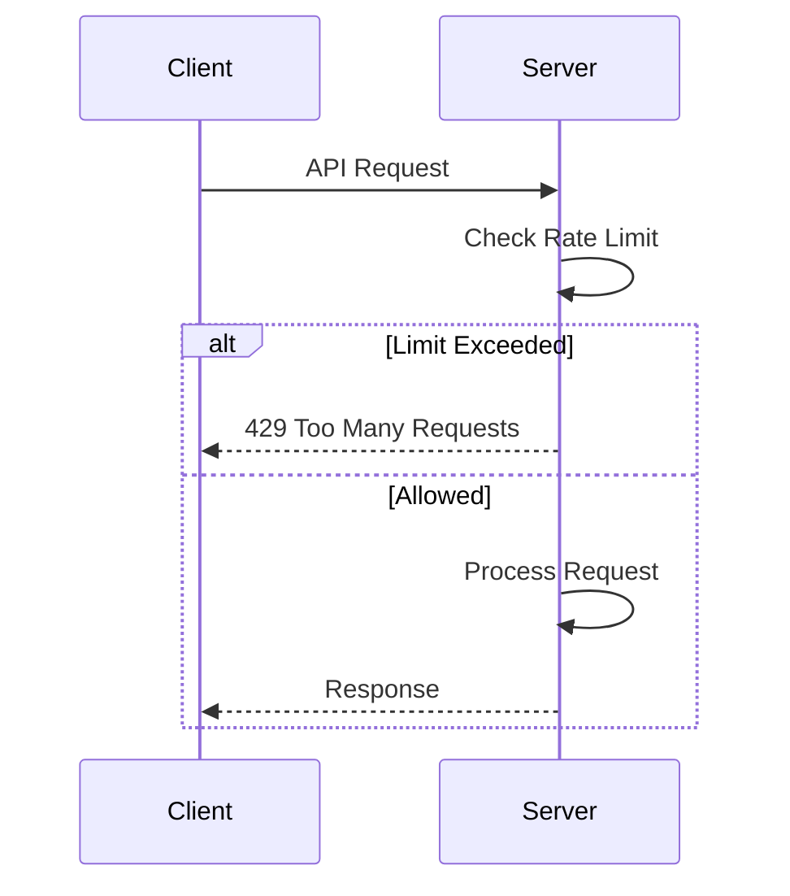
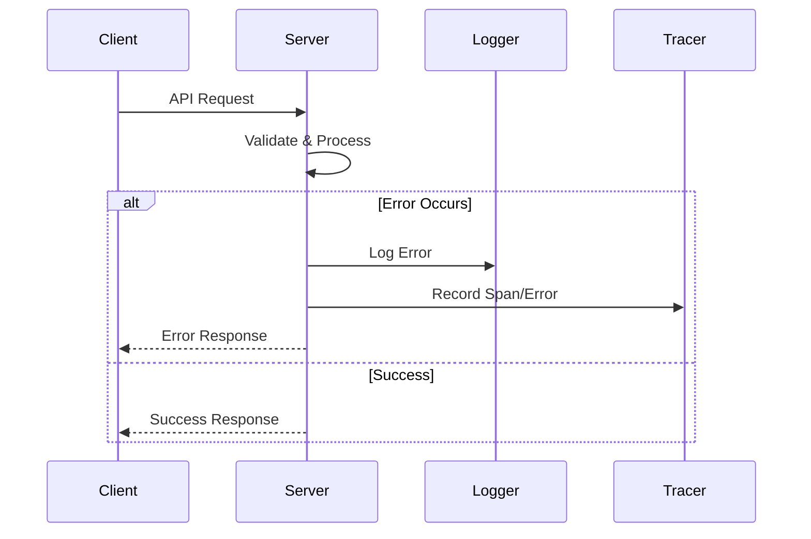
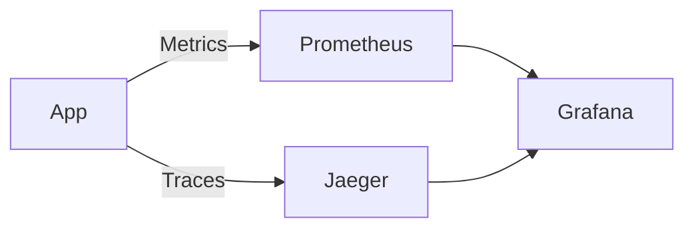
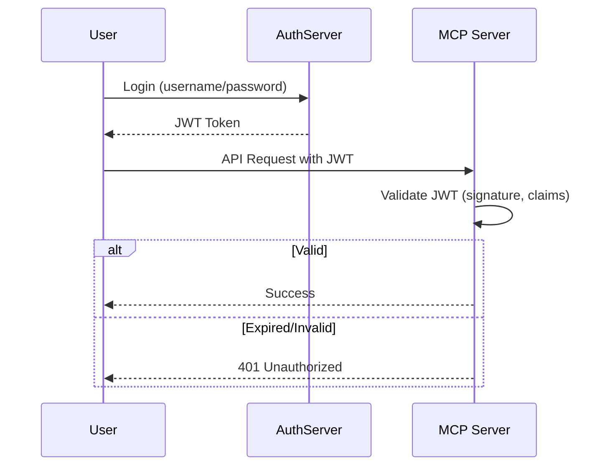

# BMC AMI DevX Code Pipeline MCP Server

[](https://github.com/<your-org>/<your-repo>/actions)
[](https://coveralls.io/github/<your-org>/<your-repo>?branch=main)
[](./reports/mutation/mutation.html)
[](./LICENSE)

A production-ready, secure, and extensible MCP server BMC AMI DevX Code Pipeline, auto-generating MCP tools from OpenAPI specs. Implements best practices for security, streaming, testing, and CI/CD.

---

## Configuration Notes (2025)

### ESLint
- Migrated to flat config (`eslint.config.js`).
- `.eslintrc.json` and `.eslintignore` are deprecated and no longer used.

### Jest
- All Jest configuration is now in `jest.config.cjs`.
- `jest.config.js` is deprecated and only present as a stub.

### Logger Test Mocking
- Logger tests (`tests/utils/logger.test.ts`) now mock both `pino` and `pino-http`.
- `pino.destination` is also mocked to avoid file descriptor errors.
- Example:
  ```typescript
  jest.mock('pino', () => Object.assign(() => ({ info: jest.fn(), error: jest.fn() }), { destination: jest.fn(() => process.stdout) }));
  jest.mock('pino-http', () => () => ({ logger: { info: jest.fn(), error: jest.fn() } }));
  ```
- This ensures logger tests pass in all environments.

### Observability & Rate Limiting
- New observability and rate limiting middleware integrated into the Express app (`src/index.ts`).
- `/metrics` endpoint and tracing are now available.

### Running Tests
- Run all tests with:
  ```sh
  npm test
  ```
- All tests should pass after the above changes.

---


## Table of Contents
- [BMC AMI DevX Code Pipeline MCP Server](#bmc-ami-devx-code-pipeline-mcp-server)
  - [Table of Contents](#table-of-contents)
  - [Quick Start](#quick-start)
  - [Features & Architecture](#features--architecture)
  - [Project Structure](#project-structure)
  - [Authentication Guide](#authentication-guide)
  # Removed duplicate TOC entry for VS Code Client Configuration
  - [Features & Architecture](#features--architecture)
  - [Environment Variables Example](#environment-variables-example)
  - [API Usage Examples](#api-usage-examples)
    - [Health Check](#health-check)
    - [404/Error Handling Example](#404error-handling-example)
    - [MCP Tool Call (JSON-RPC 2.0)](#mcp-tool-call-json-rpc-20)
    - [SSE Notifications](#sse-notifications)
  - [Security & Best Practices](#security--best-practices)
  - [Extending the Server](#extending-the-server)
  - [Testing & Quality](#testing--quality)
    - [Mutation Testing with Stryker](#mutation-testing-with-stryker)
      - [Running Mutation Tests](#running-mutation-tests)
      - [Stryker Configuration](#stryker-configuration)
  - [Documentation & Diagrams](#documentation--diagrams)
  - [Advanced Observability](#advanced-observability)
  - [Production Hardening](#production-hardening)
  - [CI/CD & Deployment](#cicd--deployment)
  - [Contributing](#contributing)
  - [FAQ / Troubleshooting](#faq--troubleshooting)
  - [Authentication Guide](#authentication-guide)
  - [API Endpoint Reference](#api-endpoint-reference)
  - [API Versioning](#api-versioning)
  - [Changelog](#changelog)
  - [Contact / Support](#contact--support)
  - [License](#license)
  - [References](#references)

---

## Features & Architecture

- **OpenAPI-to-MCP Tool Mapping:**
  - Auto-generates MCP tool endpoints from `config/openapi.json`.
  - Supports `tools/list`, `tools/call`, and notifications.
- **Streamable HTTP API:**
  - JSON-RPC 2.0 over HTTP
  - Chunked/streamed responses (Node.js streams)
  - Server-Sent Events (SSE) for notifications
  - Resumable streams with secure session management
- **Security:**
  - Bearer token authentication with JWT validation
  - No token passthrough; all tokens must be issued for this server
  - Secure, non-deterministic session IDs (`<user_id>:<session_id>`)
  - Sessions for state only (not authentication)
  - CORS and security headers (helmet.js)
  - **Strict input validation and sanitization everywhere (including integer enforcement and pattern checks)**
  - Rate limiting and request size limits
  - Structured logging (Winston or Pino)
  - Robust error handling (including 404 and rate limiting responses)
- **Health & Monitoring:**
  - `/healthz` endpoint
  - Metrics and performance monitoring (extensible)
- **Configuration:**
  - `.env` with schema validation (zod or joi)
  - Multi-environment support (development, staging, production)
- **Testing & Quality:**
  - Jest with 90%+ code coverage (**100% for critical logic and edge cases**)
  - Robust integration and edge case test coverage (input validation, error handling, rate limiting, etc.)
  - Linting/formatting (eslint, prettier, husky)
  - TypeScript strict mode
  - Security scanning (`npm audit`, `snyk`)
- **CI/CD & Docker:**
  - GitHub Actions workflow for build, lint, test, coverage, security, Docker
  - Multi-stage Dockerfile and Docker Compose
- **Extensibility:**
  - Add new tools by editing `config/openapi.json`
  - Auto-generate TypeScript types and handler templates
  - Plugin/middleware system for custom processing
- **Documentation:**
  - Auto-generated API docs (Swagger UI/Redoc)
  - Mermaid diagrams for flows (see below)
  - Comprehensive security and deployment docs

---

## Project Structure

```
├── src/
│   ├── handlers/
│   ├── middleware/
│   ├── types/
│   ├── utils/
├── config/
│   └── openapi.json
├── tests/
├── .github/
│   └── workflows/
├── .env.example
├── Dockerfile
├── docker-compose.yml
├── README.md
├── LICENSE
└── ...
```

---


  # Removed duplicate VS Code Client Configuration section

## Quick Start

1. **Install dependencies:**
   ```sh
   npm install
   ```
2. **Configure environment:**
   - Copy `.env.example` to `.env` and set values (see below for example).
   ```env
   NODE_ENV=development
   PORT=3000
   JWT_SECRET=your_jwt_secret
   ```
3. **Run in development:**
   ```sh
   npm run dev
   ```
4. **Run with Docker Compose:**
   ```sh
   docker-compose up --build
   ```
   - The app will be available at http://localhost:3000
   - Healthcheck: http://localhost:3000/healthz
5. **Build for production:**
   ```sh
   npm run build
   ```
6. **Run tests:**
   ```sh
   npm test
   ```

---


1. **Obtain a JWT Token:**  
   Use your authentication provider or the server's `/auth/login` endpoint (if enabled):

   ```sh
   ```
---

## VS Code Client Configuration

To connect to this MCP server from VS Code as a client:

1. Open your workspace settings (`.vscode/settings.json` or via Command Palette: Preferences: Open Settings (JSON)).
2. Add or update the following settings to configure the MCP server endpoint and authentication:

```json
{
  // MCP server base URL
  "mcp.serverUrl": "http://localhost:3000/v1",
  // JWT token for authentication (replace with your actual token)
  "mcp.jwtToken": "<your-jwt-token>",
  // Optionally, set request timeout (in ms)
  "mcp.requestTimeout": 10000
}
```

**Notes:**
- Replace `<your-jwt-token>` with a valid token (see [Authentication Guide](#authentication-guide)).
- Adjust `serverUrl` if your server runs on a different host or port.
- These settings are generic and can be used by any VS Code extension or custom client that supports JSON-RPC or REST calls to the MCP server.

---

## Features & Architecture

- **OpenAPI-to-MCP Tool Mapping:**
  - Auto-generates MCP tool endpoints from `config/openapi.json`.
  - Supports `tools/list`, `tools/call`, and notifications.
- **Streamable HTTP API:**
  - JSON-RPC 2.0 over HTTP
  - Chunked/streamed responses (Node.js streams)
  - Server-Sent Events (SSE) for notifications
  - Resumable streams with secure session management
- **Security:**
  - Bearer token authentication with JWT validation
  - No token passthrough; all tokens must be issued for this server
  - Secure, non-deterministic session IDs (`<user_id>:<session_id>`)
  - Sessions for state only (not authentication)
  - CORS and security headers (helmet.js)
  - **Strict input validation and sanitization everywhere (including integer enforcement and pattern checks)**
  - Rate limiting and request size limits
  - Structured logging (Winston or Pino)
  - Robust error handling (including 404 and rate limiting responses)
- **Health & Monitoring:**
  - `/healthz` endpoint
  - Metrics and performance monitoring (extensible)
- **Configuration:**
  - `.env` with schema validation (zod or joi)
  - Multi-environment support (development, staging, production)
- **Testing & Quality:**
  - Jest with 90%+ code coverage (**100% for critical logic and edge cases**)
  - Robust integration and edge case test coverage (input validation, error handling, rate limiting, etc.)
  - Linting/formatting (eslint, prettier, husky)
  - TypeScript strict mode
  - Security scanning (`npm audit`, `snyk`)
- **CI/CD & Docker:**
  - GitHub Actions workflow for build, lint, test, coverage, security, Docker
  - Multi-stage Dockerfile and Docker Compose
- **Extensibility:**
  - Add new tools by editing `config/openapi.json`
  - Auto-generate TypeScript types and handler templates
  - Plugin/middleware system for custom processing
- **Documentation:**
  - Auto-generated API docs (Swagger UI/Redoc)
  - Mermaid diagrams for flows (see below)
  - Comprehensive security and deployment docs

---

## Environment Variables Example

See `.env.example`:
```
NODE_ENV=development
PORT=3000
JWT_SECRET=your_jwt_secret
```

---

## API Usage Examples

### Health Check
```sh
curl http://localhost:3000/healthz
```

### 404/Error Handling Example
```sh
curl http://localhost:3000/nonexistent
# Returns 404 Not Found with error JSON
```

### MCP Tool Call (JSON-RPC 2.0)
```sh
curl -X POST http://localhost:3000/tools/call \
  -H "Authorization: Bearer <JWT>" \
  -H "Content-Type: application/json" \
  -d '{"jsonrpc":"2.0","method":"tools/call","params":{...},"id":1}'
```

### SSE Notifications
```sh
curl http://localhost:3000/notifications/tools/list_changed -H "Accept: text/event-stream"
```

---

## Security & Best Practices

- JWT Bearer authentication (no passthrough)
- All tokens validated and issued by this server
- Secure session IDs, no session-based auth
- Input validation, sanitization, and output escaping
- CORS and helmet.js for HTTP security
- Rate limiting and request size limits
- Audit logging and error monitoring
- See `PROMPT.md` for full security requirements

---

## Extending the Server

- Add/modify tools in `config/openapi.json`
- Handlers auto-generated and registered
- Plugin/middleware system for custom logic
- See `PROMPT.md` for extensibility framework

---

## Testing & Quality

- Run all tests: `npm test`
- Coverage: `npm run test:coverage`
- Lint: `npm run lint`
- Format: `npm run format`
- Pre-commit hooks: `husky`
- Type checking: `npm run typecheck`

---

## Mutation Testing with Stryker

This project uses [Stryker](https://stryker-mutator.io/) for mutation testing to ensure the robustness of the test suite.

### Running Mutation Tests

1. Install Stryker and dependencies (if not already installed):
   ```sh
   npm install --save-dev @stryker-mutator/core @stryker-mutator/typescript-checker @stryker-mutator/jest-runner
   ```
2. Run mutation tests:
   ```sh
   npx stryker run
   ```
3. View the mutation report:
   Open the generated HTML report at `reports/mutation/mutation.html` for detailed results.

### Stryker Configuration
- The configuration is in `stryker.conf.js`.
- Thresholds are set to break the build if the mutation score is below 50%.

---

## CI/CD & Deployment

- GitHub Actions: `.github/workflows/ci.yml`
- Multi-stage Dockerfile and Docker Compose
- Security scanning and type checking in CI
- Multi-arch Docker builds (linux/amd64, linux/arm64)

---

## Documentation & Diagrams

### Bearer Token Authentication Flow


### OpenAPI-to-MCP Tools Mapping


### MCP Protocol Message Flow


### Tool Execution and Response Handling


### Container Deployment & Observability


### Session Management and Security


### Rate Limiting Flow


### Error Handling Flow


### Observability Pipeline


### JWT Token Lifecycle


---

## Advanced Observability

### Distributed Tracing with OpenTelemetry

- The server integrates [OpenTelemetry](https://opentelemetry.io/) for distributed tracing.
- Traces are exported in OTLP format and can be sent to Jaeger, Zipkin, or any compatible backend.
- **How to view traces:**
  1. Run a local Jaeger instance:
     ```sh
     docker run -d --name jaeger -e COLLECTOR_ZIPKIN_HOST_PORT=:9411 -p 16686:16686 -p 4317:4317 -p 4318:4318 -p 14268:14268 jaegertracing/all-in-one:latest
     ```
  2. Set `OTEL_EXPORTER_OTLP_ENDPOINT` in your `.env`:
     ```env
     OTEL_EXPORTER_OTLP_ENDPOINT=http://localhost:4317
     ```
  3. Start the server and generate traffic.
  4. Open [http://localhost:16686](http://localhost:16686) to view traces.

- **Custom Spans:**
  - The codebase uses custom spans for key operations (tool execution, streaming, error handling).
  - You can add more spans using the OpenTelemetry API in your handlers or middleware.

### Metrics and Grafana Dashboards

- Prometheus metrics are exposed at `/metrics`.
- To visualize metrics in Grafana:
  1. Run Prometheus and Grafana (example Docker Compose):
     ```yaml
     version: '3'
     services:
       prometheus:
         image: prom/prometheus
         volumes:
           - ./prometheus.yml:/etc/prometheus/prometheus.yml
         ports:
           - "9090:9090"
       grafana:
         image: grafana/grafana
         ports:
           - "3001:3000"
     ```
  2. Add a Prometheus data source in Grafana pointing to `http://localhost:9090`.
  3. Import example dashboards (see `docs/grafana/` for JSON files):
     - HTTP request rate, error rate, latency, and custom business metrics.
  4. Example Prometheus scrape config:
     ```yaml
     scrape_configs:
       - job_name: 'mcp-server'
         static_configs:
           - targets: ['host.docker.internal:3000']
     ```

---

## Production Hardening

### Reverse Proxy and HTTPS
- Deploy behind a reverse proxy (e.g., NGINX, Traefik, AWS ALB) for TLS termination, request buffering, and DDoS protection.
- Always use HTTPS in production. Redirect HTTP to HTTPS at the proxy level.
- Example NGINX config:
  ```nginx
  server {
    listen 443 ssl;
    server_name yourdomain.com;
    ssl_certificate /etc/ssl/certs/fullchain.pem;
    ssl_certificate_key /etc/ssl/private/privkey.pem;
    location / {
      proxy_pass http://localhost:3000;
      proxy_set_header Host $host;
      proxy_set_header X-Real-IP $remote_addr;
      proxy_set_header X-Forwarded-For $proxy_add_x_forwarded_for;
      proxy_set_header X-Forwarded-Proto $scheme;
    }
  }
  ```

### Scaling and Resource Limits
- Use Docker resource limits or Kubernetes requests/limits to prevent resource exhaustion.
- Run multiple replicas behind a load balancer for high availability.
- Use a process manager (e.g., PM2) or container orchestrator (Kubernetes, ECS) for automatic restarts and health checks.
- Monitor memory and CPU usage; set alerts for abnormal patterns.

### Environment Hardening
- Set `NODE_ENV=production` in production environments.
- Use strong, unique secrets for `JWT_SECRET` and other credentials.
- Restrict network access to the app and database (firewalls, security groups).
- Regularly update dependencies and run `npm audit`/`snyk` scans.
- Enable logging and log rotation; forward logs to a centralized system (e.g., ELK, Datadog).
- Disable or restrict `/docs` and other debug endpoints in production if not needed.
- Review and restrict CORS origins to trusted domains only.

---

## Contributing

We welcome contributions! Please open issues or pull requests. To contribute:
- Fork the repo and create a feature branch.
- Run `npm install` and `npm test` to ensure all tests pass.
- Follow the code style (lint/format/typecheck scripts).
- Add/modify tests for your changes.
- See [CONTRIBUTING.md](./CONTRIBUTING.md) if available.

---

## FAQ / Troubleshooting

**Q: Docker Compose fails to start?**
- Ensure `docker-compose.yml` exists in the project root.
- Check for port conflicts (default: 3000).
- Ensure Docker is running and you have permissions.

**Q: JWT errors?**
- Ensure your `.env` has a valid `JWT_SECRET` and matches the signing algorithm.

**Q: How do I access API docs?**
- Visit `/docs` (Swagger UI/Redoc) when the server is running.

---

## License


---

## Quick Start Example

Start the server (see [Quick Start](#quick-start)), then call the API:

```sh
curl -X POST http://localhost:3000/v1/tools/call \
  -H "Authorization: Bearer <your-jwt-token>" \
  -H "Content-Type: application/json" \
  -d '{"method":"toolName","params":{"key":"value"}}'
```

Replace `<your-jwt-token>` with a valid token (see [Security & Best Practices](#security--best-practices)).

---

## API Endpoint Reference

| Endpoint                | Method | Description                        |
|-------------------------|--------|------------------------------------|
| `/v1/tools/list`        | POST   | List available tools               |
| `/v1/tools/call`        | POST   | Call a tool                        |
| `/v1/notifications`     | GET    | Stream notifications (SSE)         |
| `/healthz`              | GET    | Health check                       |
| `/metrics`              | GET    | Prometheus metrics                 |
| `/docs`                 | GET    | API documentation (Swagger/Redoc)  |

See the [OpenAPI spec](./config/openapi.json) or `/docs` endpoint for full details.

---

## Authentication Guide

1. **Obtain a JWT Token:**  
   Use your authentication provider or the server's `/auth/login` endpoint (if enabled):

   ```sh
   curl -X POST http://localhost:3000/auth/login \
     -H "Content-Type: application/json" \
     -d '{"username":"user","password":"pass"}'
   ```

   The response will include a JWT token.

2. **Use the Token:**  
   Add the token to the `Authorization` header for all API requests:

   ```
   Authorization: Bearer <your-jwt-token>
   ```

---

## Changelog

See [CHANGELOG.md](./CHANGELOG.md) for release notes and recent changes.

---

## Contact / Support

- Open an [issue](https://github.com/<your-org>/<your-repo>/issues)
- Join the discussion on [GitHub Discussions](https://github.com/<your-org>/<your-repo>/discussions)
- Email: support@example.com

---

## References
- [PROMPT.md](./PROMPT.md) – Full requirements and implementation details
- [config/openapi.json](./config/openapi.json) – OpenAPI spec for tool mapping
- [.env.example](./.env.example) – Example environment variables

---

## API Versioning

- All endpoints are now available under `/v1/` (e.g., `/v1/mcp/tools/list`). Legacy unversioned endpoints are still available for backward compatibility but will be deprecated.

---

## Documentation

- `/docs` always serves the latest OpenAPI spec and is updated with usage examples and error response schemas.
