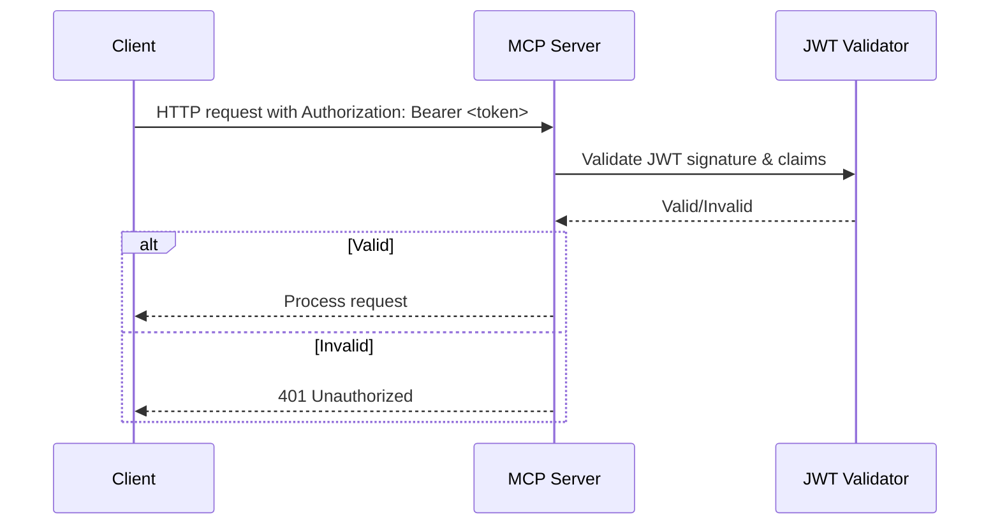
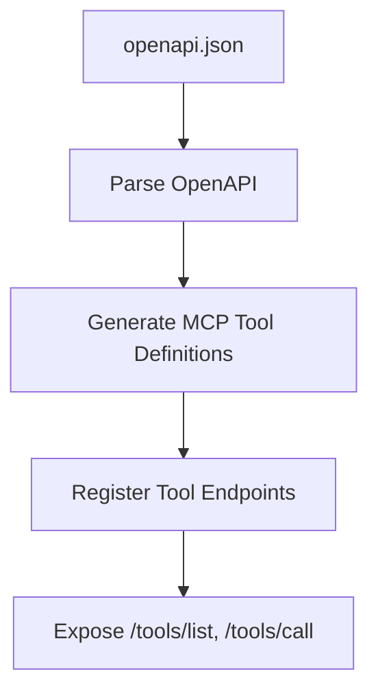
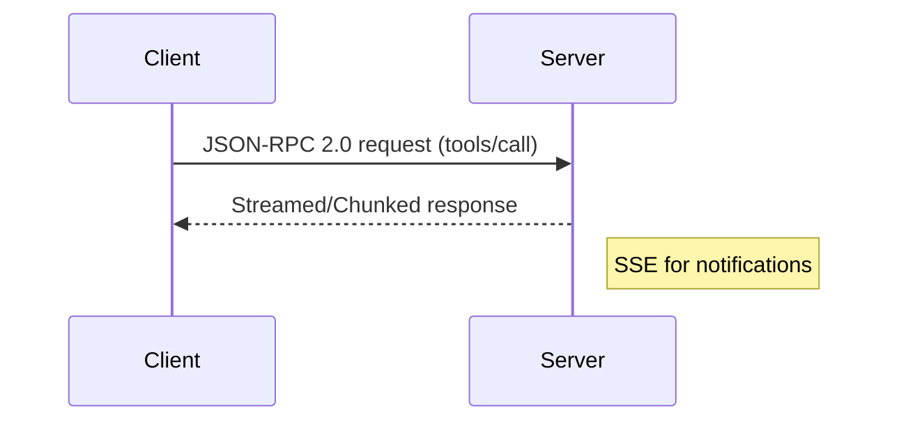
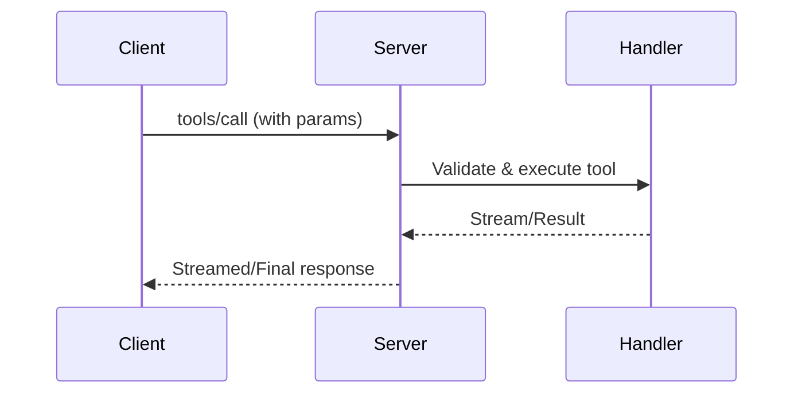
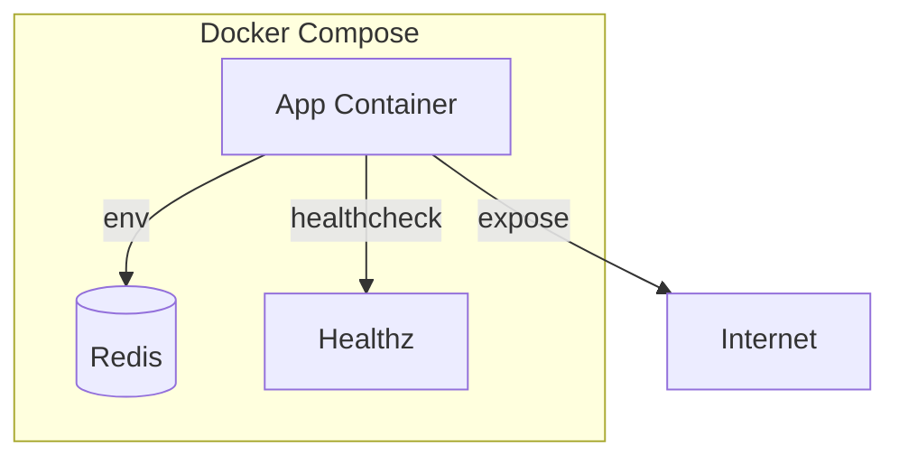
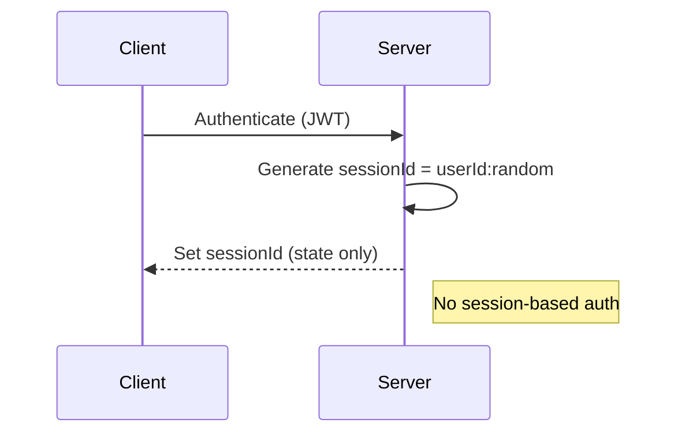

# MCP Server – TypeScript/Node.js Production Template

A production-ready, secure, and extensible MCP server for Node.js/TypeScript, auto-generating MCP tools from OpenAPI specs. Implements best practices for security, streaming, testing, and CI/CD.

---

## Project Structure

```
.
├── src/
│   ├── handlers/
│   ├── middleware/
│   ├── types/
│   ├── utils/
├── config/
│   └── openapi.json
├── tests/
├── .github/
│   └── workflows/
├── .env.example
├── Dockerfile
├── docker-compose.yml
├── README.md
├── LICENSE
└── ...
```

---

## Quick Start

1. **Install dependencies:**
   ```sh
   npm install
   ```
2. **Configure environment:**
   - Copy `.env.example` to `.env` and set values.
3. **Run in development:**
   ```sh
   npm run dev
   ```
4. **Build for production:**
   ```sh
   npm run build
   ```
5. **Run tests:**
   ```sh
   npm test
   ```

---

## Features & Architecture

- **OpenAPI-to-MCP Tool Mapping:**
  - Auto-generates MCP tool endpoints from `config/openapi.json`.
  - Supports `tools/list`, `tools/call`, and notifications.
- **Streamable HTTP API:**
  - JSON-RPC 2.0 over HTTP
  - Chunked/streamed responses (Node.js streams)
  - Server-Sent Events (SSE) for notifications
  - Resumable streams with secure session management
- **Security:**
  - Bearer token authentication with JWT validation
  - No token passthrough; all tokens must be issued for this server
  - Secure, non-deterministic session IDs (`<user_id>:<session_id>`)
  - Sessions for state only (not authentication)
  - CORS and security headers (helmet.js)
  - Input validation and sanitization everywhere
  - Rate limiting and request size limits
  - Structured logging (Winston or Pino)
  - Robust error handling
- **Health & Monitoring:**
  - `/healthz` endpoint
  - Metrics and performance monitoring (extensible)
- **Configuration:**
  - `.env` with schema validation (zod or joi)
  - Multi-environment support (development, staging, production)
- **Testing & Quality:**
  - Jest with 90%+ code coverage
  - Linting/formatting (eslint, prettier, husky)
  - TypeScript strict mode
  - Security scanning (`npm audit`, `snyk`)
- **CI/CD & Docker:**
  - GitHub Actions workflow for build, lint, test, coverage, security, Docker
  - Multi-stage Dockerfile and Docker Compose
- **Extensibility:**
  - Add new tools by editing `config/openapi.json`
  - Auto-generate TypeScript types and handler templates
  - Plugin/middleware system for custom processing
- **Documentation:**
  - Auto-generated API docs (Swagger UI/Redoc)
  - Mermaid diagrams for flows (see below)
  - Comprehensive security and deployment docs

---

## Environment Variables Example

See `.env.example`:
```
NODE_ENV=development
PORT=3000
JWT_SECRET=your_jwt_secret
```

---

## API Usage Examples

### Health Check
```sh
curl http://localhost:3000/healthz
```

### MCP Tool Call (JSON-RPC 2.0)
```sh
curl -X POST http://localhost:3000/tools/call \
  -H "Authorization: Bearer <JWT>" \
  -H "Content-Type: application/json" \
  -d '{"jsonrpc":"2.0","method":"tools/call","params":{...},"id":1}'
```

### SSE Notifications
```sh
curl http://localhost:3000/notifications/tools/list_changed -H "Accept: text/event-stream"
```

---

## Security & Best Practices

- JWT Bearer authentication (no passthrough)
- All tokens validated and issued by this server
- Secure session IDs, no session-based auth
- Input validation, sanitization, and output escaping
- CORS and helmet.js for HTTP security
- Rate limiting and request size limits
- Audit logging and error monitoring
- See `PROMPT.md` for full security requirements

---

## Extending the Server

- Add/modify tools in `config/openapi.json`
- Handlers auto-generated and registered
- Plugin/middleware system for custom logic
- See `PROMPT.md` for extensibility framework

---

## Testing & Quality

- Run all tests: `npm test`
- Coverage: `npm run test:coverage`
- Lint: `npm run lint`
- Format: `npm run format`
- Pre-commit hooks: `husky`
- Type checking: `npm run typecheck`

---

## CI/CD & Deployment

- GitHub Actions: `.github/workflows/ci.yml`
- Multi-stage Dockerfile and Docker Compose
- Security scanning and type checking in CI
- Multi-arch Docker builds (linux/amd64, linux/arm64)

---

## Documentation & Diagrams

### Bearer Token Authentication Flow


### OpenAPI-to-MCP Tools Mapping


### MCP Protocol Message Flow


### Tool Execution and Response Handling


### Container Deployment


### Session Management and Security


---

## License

See [LICENSE](./LICENSE).

---

## References
- [PROMPT.md](./PROMPT.md) – Full requirements and implementation details
- [config/openapi.json](./config/openapi.json) – OpenAPI spec for tool mapping
- [.env.example](./.env.example) – Example environment variables

---
