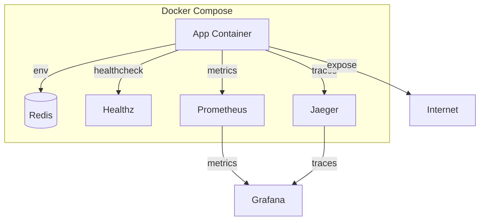
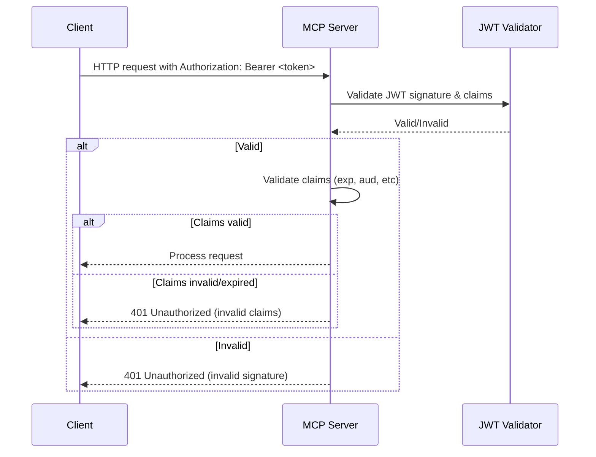
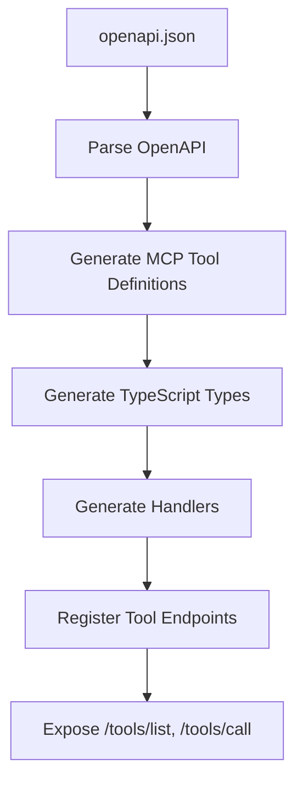

# Architecture Overview

This document provides a high-level overview of the MCP server architecture, including diagrams and explanations of key flows.

## System Diagram

## Authentication Flow

## Tool Mapping Flow

See README for more diagrams and details.
